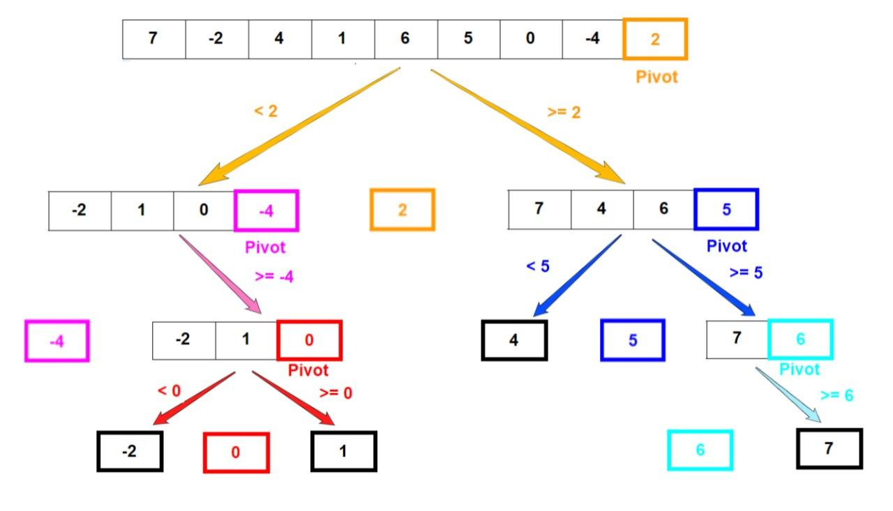

# Apa itu array
Array adalah tipe data yang digunakan untuk menyimpan banyak data. Array memiliki index berupa angka, dimulai dari 0 s/d n-1
contoh
``` c/cpp

#include <iostream>
using namespace std;

int main(){
    int [5] arr = {0, 1, 2, 3, 4};
    cout << arr[0]; //mengakses elemen ke-1
    cout << arr[4]; // mengakses elemen terakhir
}

```
Contoh algoritma pada array:
1. mencari nilai k pada sekumpulan array (searching)
2. Mengurutkan array (sorting)

## Buble sort
langkah algoritma:
1. misalkan ada array tidak terurut `int [5] arr = {4, 3, 1, 0, 2}`
2. Lihat pada dua elemen array pertama, yaitu 4 dan 3 lalu bandingkan. Apakah 4<3? jika tidak maka tukar.
hasil: `3, 4, 1, 0, 2`
3. Maju 1 langkah, dan ambil nilai berikutnya untuk dibandingkan. Apakah 4<1? jika tidak maka tukar.
hasil `3, 1, 4, 0, 2`
4. Ambil elemen ke-3 dan bandingkan dengan nilai selanjutnya. Apakah 4<0?
hasil: `3, 1, 0, 4, 2`
5. Ambil elemen ke-4 dan bandingkan dengan nilai selanjutnya. Apakah 4<2?
hasil: `3, 1, 0, 2, 4`
6. Ulangi langkah 2 - 5, namun hanya berakhir pada elemen ke n-3
7. Ambil elemen pertama, dan bandingkan dengan elemen i+1 apakah 3<1? 
hasil: `1, 3, 0, 2, 4`
8. Ulangi langkah 7
hasil: `1, 0, 3, 2, 4`
9. Ulangi langkah 8
hasil: `1, 0, 2, 3, 4`
10. Ulangi lagi sampai semua elemen berurutan
hasil: `0, 1, 2, 3, 4`
11. `0, 1, 2, 3, 4`
12. Selesai

```python
def bubble_sort(arr):
    n = len(arr)
    for i in range(n):
        for j in range(0, n - i - 1):
            if arr[j] > arr[j + 1]:
                arr[j], arr[j + 1] = arr[j + 1], arr[j]
```
Karena buble sort menggunakan 2 kali perulangan bersarang, maka memiliki kompleksitas O(n^2).

## Selection Sort
Selection sort mencari nilai terkecil dari sekumpulan array lalu memindahkannya ke urutan terdepan

```
def selection_sort(arr):
    n = len(arr)
    for i in range(n):
        # Temukan nilai minimum di sisa array yang belum diurutkan
        min_idx = i
        for j in range(i+1, n):
            if arr[j] < arr[min_idx]:
                min_idx = j
        # Tukar elemen minimum yang ditemukan dengan elemen pertama dari yang belum diurutkan
        arr[i], arr[min_idx] = arr[min_idx], arr[i]

```

## Insertion Sort
Algoritma insertion sort berkerja dengan mengambil elemen pada array tidak terurut, lalu meletakkan pada bagian yang benar dari sebuah array terurut


Alur:
1. Ambil nilai dari array tidak terurut
2. Letakkan nilai tersebut pada tempat yang benar dari sekumpulan array terurut
3. Ulangi langkah 1 - 2 sebanyak elemen yang ada pada array

Kode:
```
def insertion_sort(arr):
    # Traverse through 1 to len(arr)
    for i in range(1, len(arr)):
        key = arr[i]
        # Move elements of arr[0...i-1], that are greater than key, to one position ahead of their current position
        j = i - 1
        while j >= 0 and key < arr[j]:
            arr[j + 1] = arr[j]
            j -= 1
        arr[j + 1] = key


```
insertion sort memiliki 2 kali perulangan bersarang, sehingga memiliki kompleksitas O(n^2)

## Quick Sort
Quick sort merupakan salah satu algoritma tercepat.
Quick sort memilih sebuah nilai dari array sebagai pivot, kemudian memindahkan elemen yang lebih kecil dari pivot pada sebelah kiri, dan sebelah kanan untuk nilai yang lebih besar

Alur:
1. Pilih elemen pivot sembarang dari array tak terurut
2. Urutkan elemen yang tidak terurut, dimana setiap elemen yang lebih kecil drpd pivot berada di sebelah kiri. Sedangkan yang lebih besar di sebelah kanan.
3. Tukar elemen pivot dengan elemen pertama dari nilai yang lebih tinggi sehingga elemen pivot mendarat di antara nilai yang lebih rendah dan lebih tinggi
4. Lakukan operasi yang sama (secara rekursif) untuk sub-larik di sisi kiri dan kanan elemen pivot.
