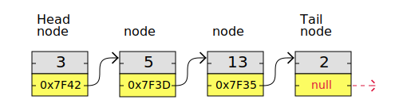
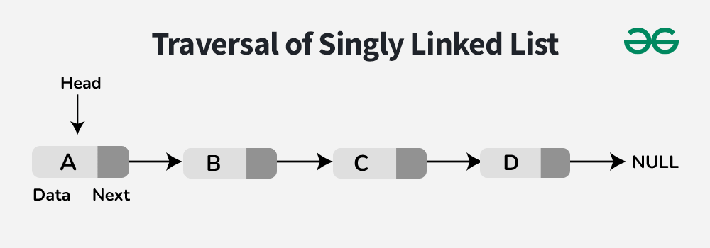
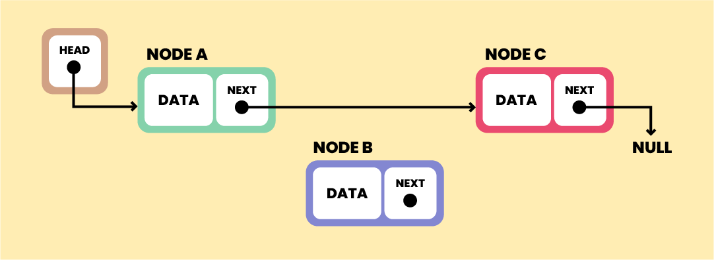

# Apa itu Linkedlist

Linked list adalah sebuah struktur data dimana terdapat sekumpulan data yang saling terhubung dengan pointer atau link

Keuntungan linked list adalah setiap node dapat disimpan di bagian memori manapun yang tersedia, tidak perlu persis di samping node lainnya, tidak seperti array. Kemudian jika sebuah node ingin dihapus, semua node pada linked list tidak perlu di shift

Perbedaan linkedlist dan array:
1. linked list adalah struktur data yg kita buat sendiri, sedangkan array built-in
2. Node pada linked list perlu menyimpan 'link' untuk terhubung dengan node lain. Array tidak perlu

Senarai berantai digunakan dalam banyak skenario, seperti penyimpanan data dinamis, implementasi tumpukan dan antrean, atau representasi grafik, untuk menyebutkan beberapa di antaranya.

Senarai berantai terdiri dari simpul-simpul dengan beberapa jenis data, dan setidaknya satu penunjuk, atau tautan, ke simpul-simpul lain.

simpul pertama dalam sebuah daftar berantai disebut "Kepala", dan simpul terakhir disebut "Ekor".

## operasi linked list
#### Traversal
Traversal adalah operasi berulang untuk berpindah menuju node terhubung lainnya.

langkah:
1. Pilih node kepala
2. buat node temporary dan lakukan assignment pada node tersebut dengan value node kepala
3. lakukan  perulangan dengan kondisi node tidak kosong (null)

python code:
```
class Node:
    def __init__(self, data):
        self.data = data
        self.next = None

class LinkedList:
    def __init__(self):
        self.head = None

    def append(self, data):
        new_node = Node(data)
        if self.head is None:
            self.head = new_node
            return
        last = self.head
        while last.next:
            last = last.next
        last.next = new_node

    def traverse(self):
        current = self.head
        while current:
            print(current.data)
            current = current.next

# Contoh penggunaan:
if __name__ == "__main__":
    llist = LinkedList()
    llist.append(1)
    llist.append(2)
    llist.append(3)
    llist.traverse()

```

Traversal adalah operasi fundamental, dimana berbagai operasi lain seperti penyisipan dan penghapusan elemen menggunakan traversal.

#### Penyisipan
Penyisipan adalah metode untuk menambah node baru ke dalam linked list.
langkah-langkah:
1. tentukan node kepala, node baru, dan posisi
2. buat node sementara menggunakan nilai dari node kepala.
3. Jika node baru disisipkan di sebelah kiri node kepala, maka sambungkan node baru dengan node kepala. Kemudian return node baru sebagai node kepala
4. Jika tidak, lakukan proses traversal hingga di sebelah kiri posisi `(index < posisi)`. Pada posisi ini, node sementara akan berada pada posisi index. Maka sambungkan node baru dengan node setelah node sementara. Kemudian node sementara disambungkan dengan node baru.

```
class Node:
    def __init__(self, data):
        self.data = data
        self.next = None

class LinkedList:
    def __init__(self):
        self.head = None

    def append(self, data):
        new_node = Node(data)
        if self.head is None:
            self.head = new_node
            return
        last = self.head
        while last.next:
            last = last.next
        last.next = new_node

    def traverse(self):
        current = self.head
        while current:
            print(current.data)
            current = current.next

    def insert(self, prev_node, data):
        if prev_node is None:
            print("Node sebelumnya tidak ada dalam list")
            return
        new_node = Node(data)
        new_node.next = prev_node.next
        prev_node.next = new_node

# Contoh penggunaan:
if __name__ == "__main__":
    llist = LinkedList()
    llist.append(1)
    llist.append(2)
    llist.append(4)
    
    print("Linked List sebelum penyisipan:")
    llist.traverse()
    
    llist.insert(llist.head.next, 3)  # Menyisipkan node baru dengan data 3 setelah node kedua
    
    print("\nLinked List setelah penyisipan:")
    llist.traverse()

```

#### Menghapus Node