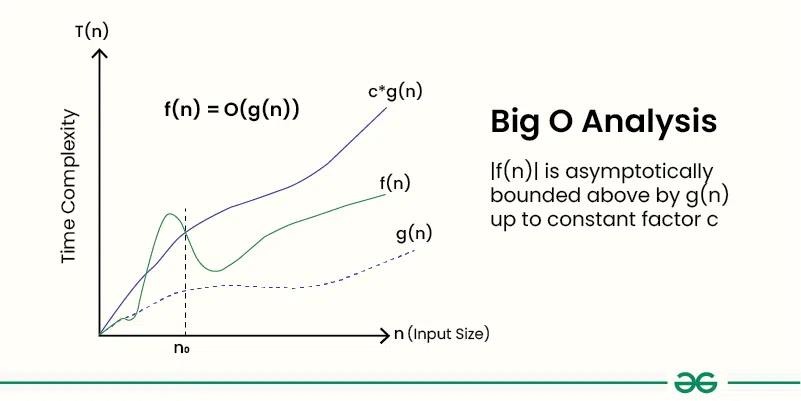

# Tujuan
Repo ini dibuat sebagai repo pembelajaran untuk algoritma dan struktur data
# Mengenal notasi big 0
notasi big-0 adalah alat yang digunakan untuk mengukur komplesitas waktu komputasi untuk menjalankan suatu algoritma atau fungsi()
## Definisi (time complexity)
Diberikan dua buah fungsi f(n) dan g(n), dimana nilai `f(n)` adalah `0(g(n))`, jika konstanta `c > 0 dan n0 > 0`, sehingga `f(n) <= c*g(n)`, untuk semua `n>=n0`

`f(n) = 0(g(n))`, jika c>0 dan n0 > 0, dan n>=n0
- n: ukuran input
- f(n): waktu komputasi
- c: konstanta, f(n) harus lebih kecil sama dengan c*g(n)
- g(n): fungsi kompleksitas waktu
[]

## sifat2

1. Reflektivitas.
Untuk fungsi apa pun f(n), f(n) = O(f(n)).
misal. f(n) = log(n), maka f(n) = O(log(n))
2. Transatifitas
Jika f(n) = O(g(n)) dan g(n) = O(h(n)), maka f(n) = O(h(n))

contoh: 
f(n) = n^3 , g(n) = n^2 , h(n) = n^4
- reflektivitas: f(n) = n^3 -> f(n) = O(n^3)
- Jika fn = O(gn), gn = O(h(n)), maka f(n) = O(h(n))
3. Faktor konstan
Untuk setiap konstanta c > 0 dan fungsi f(n) dan g(n), jika f(n) = O(g(n)), maka cf(n) = O(g(n)).

Contoh:
f(n) = n, g(n) = n 2 . Maka f(n) = O(g(n)). Oleh karena itu, 2f(n) = O(g(n)).
4. Aturan Jumlah
Jika f(n) = O(g(n)) dan h(n) = O(g(n)), maka f(n) + h(n) = O(g(n))
5. Aturan produk
Jika f(n) = O(g(n)) dan h(n) = O(k(n)), maka f(n) * h(n) = O(g(n) * k(n)).
6. Aturan komposisi
Jika f(n) = O(g(n)) dan g(n) = O(h(n)), maka f(g(n)) = O(h(n)).

# Mengenal Space complexity
Space complexity adalah suatu metriks atau ukuran untuk mengukur jumlah memori yang diperlukan untuk menjalankan suatu algoritma
## Notasi Space complexity
1. Notasi Big-O: 
"Jumlah memori yang dipakai pada suatu algoritma tidak bertambah melebihi f(x)." Contoh notasi Big-O:
O(n), O(log(n)), dll
BigO digunakan untuk mengukur skenario terburuk pada suatu laju pertumbuhan
2. Notasi Omega
"Jumlah memori yang bertambah tidak lebih lambat dari f(x), tetapi dapat lebih cepat". Notasi omega digunakan untuk mengukur skenario terbaik pada laju 
pertambahan memori suatu algoritma.
## Menganalisa kompleksitas ruang
Menganalisa dengan notasi Big-O
1. kompleksitas O(1)
```
public int sum(int a, int b) {
    return a + b;
}
```
2. Komleksitas O(n)
```
public boolean findNumber(int []arr, int key){
    int length = len(arr);
    for (int i = 0; i < length; i++){
        if (arr[k] == key) {
            return true;
        }
    }
    return false;
}
```
# Struktur Data dan Algoritma
- Struktur data: suatu cara untuk menyimpan data pada struktur yang berbeda
- Algoritma: berbagai cara untuk menyelesaikan suatu masalah, biasanya dengan cara 'mencari-melalui' dan memanipulasi struktur data
## Apa itu Struktur Data dan Algoritma 
1. Struktur data
Suatu struktur data disusun berdasarkan cara untuk menyimpan. Struktur data disusun berdasarkan jenis data yang ada, dan apa yang ingin dilakukan terhadap data tersebut.
Jenis2 struktur data:
- data primitif {integer, float, boolean}
- Array
- Linked List
- Stack
- Queue
- Tree
- Graph
- Hash Table
- Heap
Misalkan kita ingin melihat silsilah keluarga, maka akan dibuatkan bagan 'family tree'. Dengan pohon keluarga, kita dapat melihat siapa kakek, nenek, ayah, adik, dll.
Struktur data membuat cara dalam mengelola suatu data besar menjadi sangat efisien.

2. Apa itu algoritma
Algoritma adalah set urutan instruksi untuk mencapai suatu tujuan spesifik. Contoh implementasi algoritma:
- Menemukan rute tercepat dalam sistem navigasi GPS
- Menavigasi pesawat atau mobil (pengendalian jelajah)
- Menemukan apa yang dicari pengguna (mesin pencari)
- Mengurutkan, misalnya mengurutkan film berdasarkan rating
DSA adalah tentang penggunaan struktur data dan algoritma untuk efisiensi penyimpanan, pengambilan, dan manipulasi data untuk menyelesaikan masalah

# Konten/Topik
0. Implementasi kompleksitas waktu `/loop-comparison`
1. Fibonaci `/fibonacci`
2. Array `/array`