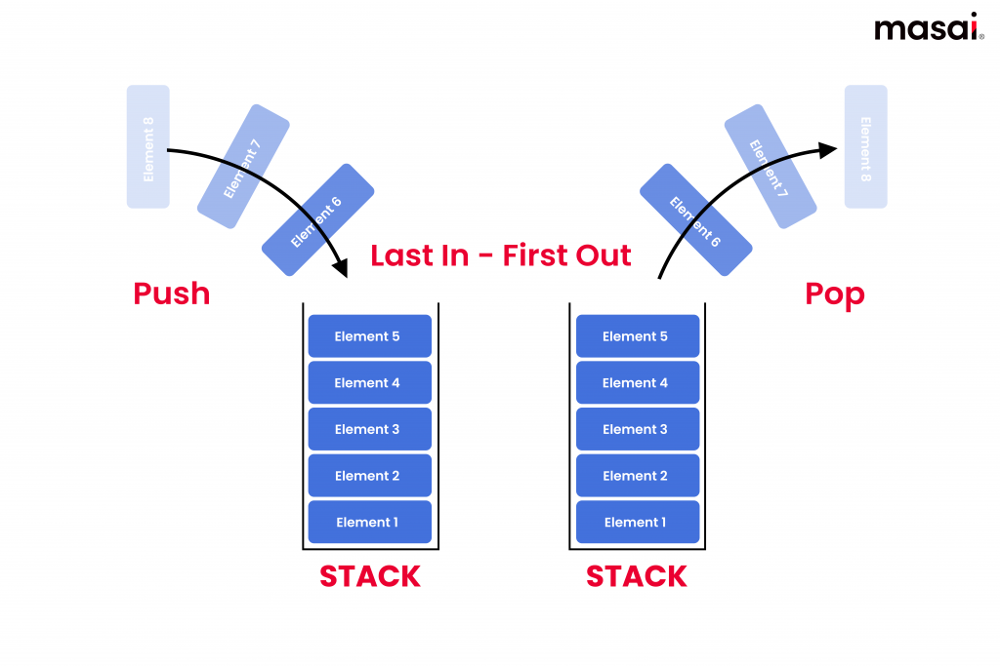
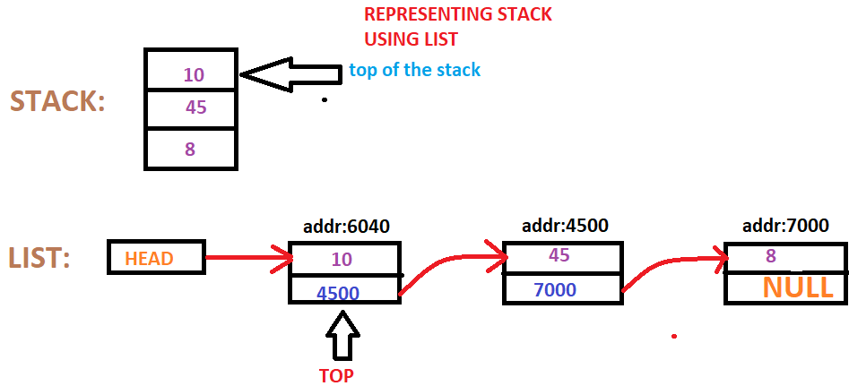

# Stack
## Pengertian
Stack atau tumpukan adalah struktur data yang memiliki urutan LIFO, yaitu elemen yang terakhir kali ditambahkan adalah elemen yang pertama kali diakses.
Stack dapat diibaratkan seperti tumpukan lipatan baju. Jika kita ingin mengambil baju maka harus mengambilnya dari yang paling atas.


Operasi dasar pada stack adalah:
- Push: Menambahkan data baru deri paling belakang.
- Pop: Menghapus data baru dari urutan paling belakang.
- Peek: Melihat data pada urutan terbelakang
- IsEmpety: Mengecek apakah tumpukan kosong.
- Size: Mencari jumlah data pada stack

Stack sering digunakan pada aplikasi yang memerlukan fitur 'undo' atau tracking history, seperti google docs.
Implementasi stack secara umum menggunakan 2 struktur data, yaitu array dan linkedlist.

## Implementasi Stack dengan Array
Keuntungan implementasi stack dengan array:
1. Efisiensi memory: Array tidak perlu menyimpan alamat node berikutnya.
2. Mudah diimplementasikan: Array termasuk struktur data sederhana sehinggga lebih mudah diimplementasi

Kekurangan stack dengan array:
1. Ukuran tetap: ukuran sebuah array adalah tetap, sehingga stack tidak dinamis

kode python:
```
stack = []

# Push
stack.append('A')
stack.append('B')
stack.append('C')
print("Stack: ", stack)

# Pop
element = stack.pop()
print("Pop: ", element)

# Peek
topElement = stack[-1]
print("Peek: ", topElement)

# isEmpty
isEmpty = not bool(stack)
print("isEmpty: ", isEmpty)

# Size
print("Size: ",len(stack))
```


## Implementasi Stack dengan Linked List
Alasan implementasi dengan linked list:
1. Ukuran stack dinamis.

Kekurangan stack dengan linked list:
1. Boros memori: Setiap node perlu menyimpan pointer ke node berikutnya
2. Sulit diimplementasikan: Untuk implementasi dengan linkedlist maka perlu untuk memahami bagaimana linkedlist berkerja



```
class Node:
    def __init__(self, value):
        self.value = value
        self.next = None

class Stack:
    def __init__(self):
        self.head = None
        self.size = 0
    
    def push(self, value):
        new_node = Node(value)
        if self.head:
            new_node.next = self.head
        self.head = new_node
        self.size += 1
    
    def pop(self):
        if self.isEmpty():
            return "Stack is empty"
        popped_node = self.head
        self.head = self.head.next
        self.size -= 1
        return popped_node.value
    
    def peek(self):
        if self.isEmpty():
            return "Stack is empty"
        return self.head.value
    
    def isEmpty(self):
        return self.size == 0
    
    def stackSize(self):
        return self.size

myStack = Stack()
myStack.push('A')
myStack.push('B')
myStack.push('C')

print("Pop: ", myStack.pop())
print("Peek: ", myStack.peek())
print("isEmpty: ", myStack.isEmpty())
print("Size: ", myStack.stackSize())
```